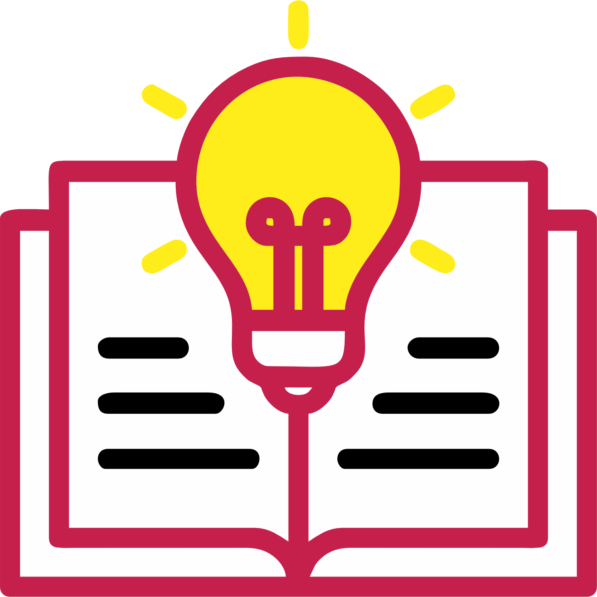

## Этапы работы над проектом, разработка дизайна:

- Заполнение брифа
- Подбор референсов
- Подбор цветов
- Отрисовка нескольких макетов
- Внесение корректировок
- Согласование макета
- Передача готового favicon для публикации на сайте

## И готовый favicon в формате .ico

## Обо мне
Обожаю своих клиентов и их заказы! 😊
Люблю воплощать уникальные идеи в жизнь. Главное — результат радует и заказчика, и меня! ❤️

**Мой подход:**
- Индивидуальный подход к заказчику 👍🏻
- Возможность внесения корректировок
- Подбор цветов и шрифтов

**Контакты:**

📞 A1: +375 29 651 22 88 (+ Viber)

📸 Я в [Instagram](https://www.instagram.com/engraver.by/)



**Услуги:**
- Графический дизайн
- Web-дизайн
- UX/UI дизайн

Ваша — Вероника Чернопятова 🤗
