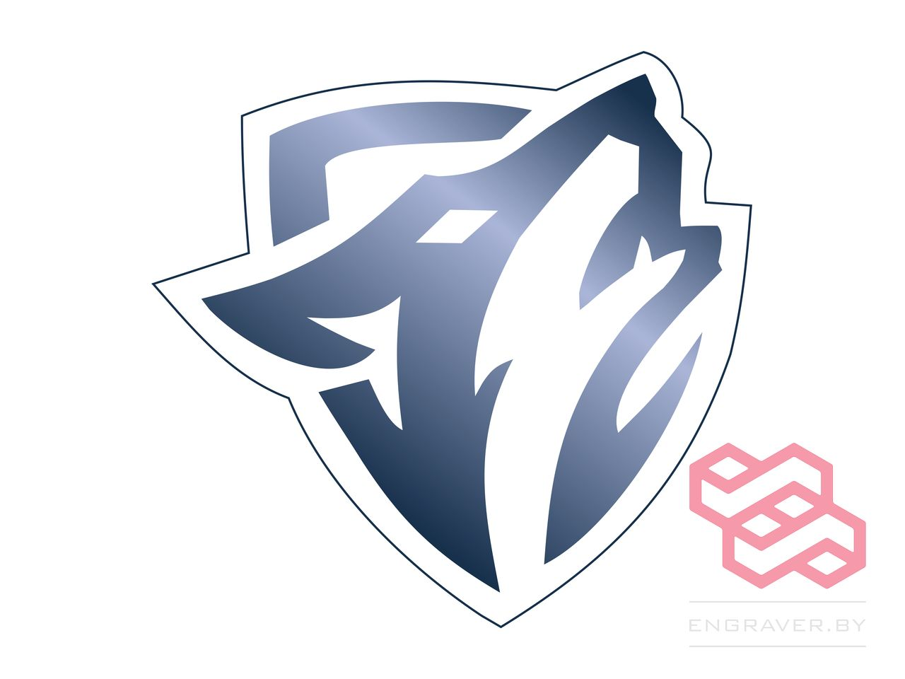
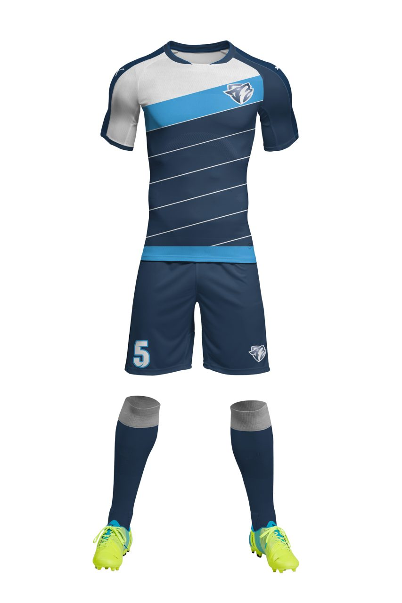
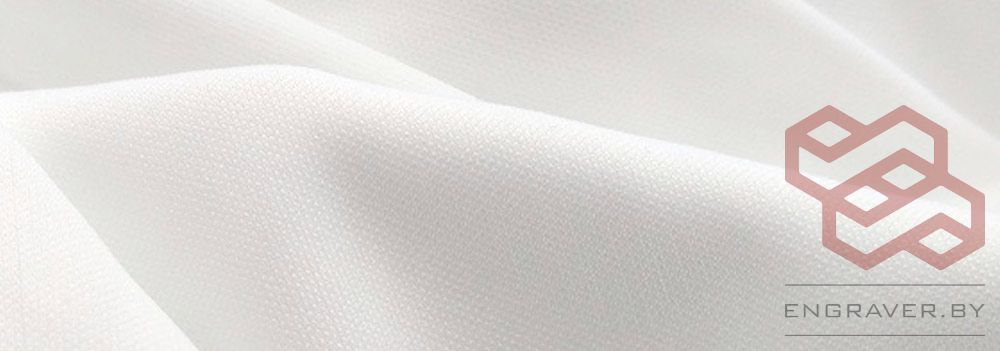

## Этапы работы над проектом, разработка дизайна:  

- Заполнение брифа
- Подбор референсов
- Подборка шрифтов
- Подбор цветов
- Отрисовка нескольких макетов
- Отрисовка логотипа команды
- Внесение корректировок
- Согласование макета
- Подбор размеров
- Работа с лекалами
- Раскладка дизайна в лекала
- Подготовка к печати
- Передача на изготовление

## Отрисовка логотипа команды. Графический дизайн  
По предоставленному изображению в формате .jpg создан векторный логотип команды. Векторная печать обеспечивает высокое качество и четкость изображения.

## Разработка дизайна спортивной формы Варги. Разработка логотипа  
### Технология изготовления  
После разработки дизайна и передачи заказа в производство начинается следующий этап. Заготовки печатаются на принтере, затем сублимационная печать переносится на ткань. Цвета, рисунки, номера и фамилии получаются четкими, яркими и качественными. Используется профессиональная спортивная ткань, которая:
- Хорошо дышит
- Не впитывает влагу
- Быстро сохнет

Дизайн надежно спекается с тканью, сохраняя яркость цветов и форму даже после стирки при 60–70°C.

## Разработка дизайна спортивной формы Варги  
### Сублимационная печать  
Сублимационная (дисперсная) печать — метод окрашивания светлых синтетических материалов (полиэфир, полиамид, ацетат). Особенности:
- Яркие, устойчивые к внешним воздействиям цвета
- Краситель переходит из твердого в газообразное состояние при 180–200°C, минуя жидкую фазу

## Ткань для футбольной формы  
**Интерлок Прима Микрофибра**
- 100% полиэфирный спортивный трикотаж с гладкой структурой
- Интерлочное переплетение (interlock — «перекрещивание»)
- Эластичный, прочный, не деформируется при растяжении
- Хорошо впитывает влагу и быстро сохнет
- Один из самых популярных материалов для сублимационной формы в футболе, волейболе, баскетболе и других видах спорта

Ткань комфортна, не натирает, поддерживает оптимальную температуру тела.

## Разработка дизайна и пошив волейбольной формы. Графический дизайн  
**Ткань Прима Микрофибра**:
- Современный спортивный трикотаж с гладкой структурой
- Приятен к телу, не вызывает дискомфорта
- Обеспечивает комфорт при активных движениях

## Обо мне  
Обожаю своих клиентов и их заказы! 😊
Люблю воплощать уникальные идеи в жизнь. Главное — результат радует и заказчика, и меня! ❤️

**Мой подход:**
- Индивидуальная разработка дизайна 👍🏻
- Индивидуальное изготовление
- Возможность добавить любое имя, логотип, рисунок или надпись
- Бесплатный макет изделия! 🤑

**Контакты:**
📞 A1: +375 29 651 22 88 (+ Viber)

📸 Я в [Instagram](https://www.instagram.com/engraver.by/)



**Услуги:**
- Графический дизайн
- Web-дизайн
- UX/UI дизайн

Ваша — Чернопятова Вероника 🤗