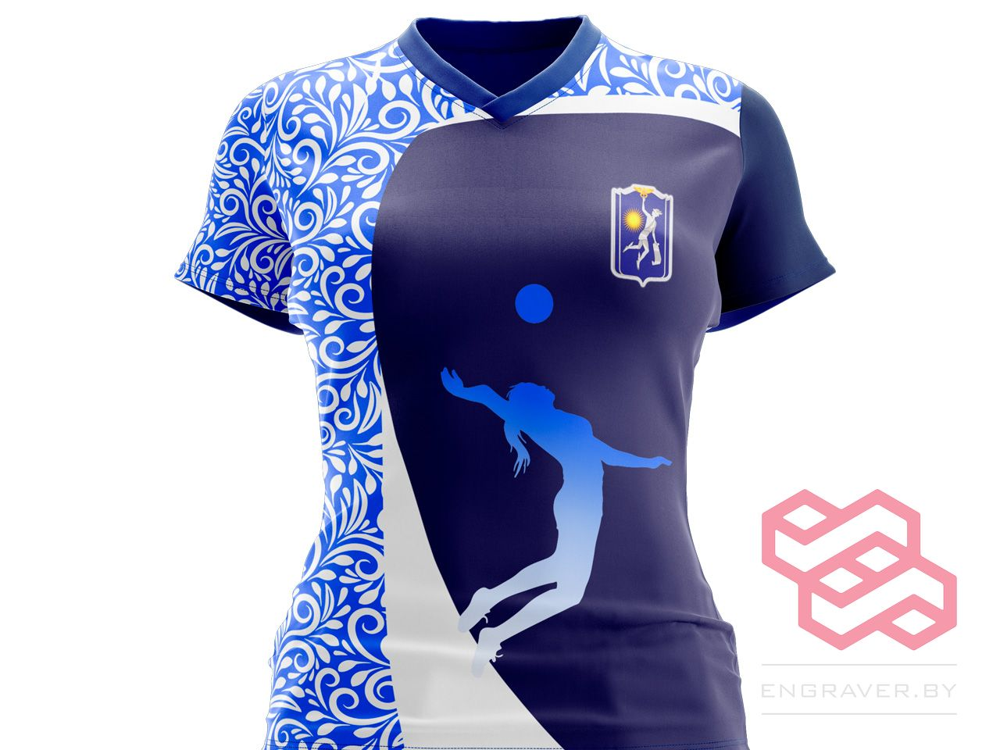

## Этапы работы над проектом, разработка дизайна:

- Заполнение брифа
- Подбор референсов
- Подборка шрифтов
- Подбор цветов
- Отрисовка нескольких макетов
- Внесение корректировок
- Согласование макета
- Подбор размеров
- Работа с лекалами
- Раскладка дизайна в лекала
- Подготовка к печати
- Передача на изготовление

## Технология изготовления

После разработки дизайна и передачи заказа в работу начинается следующий этап. Заготовки печатаются на принтере, затем сублимационная печать переносится на ткань. Цвета, рисунки, номера и фамилии — всё очень чётко, ярко и качественно. Используется профессиональная спортивная ткань, которая хорошо дышит, не впитывает влагу и быстро высыхает. Дизайн спекается с тканью качественно, и даже при стирке при 60–70°C цвета не тускнеют, ткань не деформируется, а дизайн сохраняется в первозданном виде.

## Сублимационная печать

Форма изготавливается сублимационной печатью. Что это такое?

Сублимационная печать (дисперсная) — способ окрашивания светлых синтетических тканных материалов: полиэфирных, полиамидных, ацетатных. Позволяет получить яркие цвета, устойчивые к воздействию окружающей среды. Отличительная черта — при нагревании дисперсный краситель переходит из твердого в газообразное состояние, минуя жидкую фазу. Возгонка красителя происходит в диапазоне температур 180–200°C.

## Ткань для волейбольной формы

**ИНТЕРЛОК ПРИМА МИКРОФИБРА**

- Современный 100% полиэфирный спортивный трикотаж, имеющий гладкую структуру с обеих сторон.
- Интерлочное переплетение обладает характерным переплетением петель, которое называется *interlock* — «перекрещивание».
- Материал эластичный и прочный, не деформируется при растяжении, хорошо впитывает влагу, быстро сохнет.
- Один из самых популярных материалов для сублимационной формы в футболе, волейболе, баскетболе и других игровых видах спорта.

Помимо технических характеристик, интерлок очень приятен к телу. В спортивной форме из этой ткани комфортно, ничего не натирает, тело легко дышит и поддерживает комфортную температуру.

## Обожаю своих клиентов и заказы от них!

Обожаю воплощать интересные и разные идеи в жизнь 😊
Но главное — результат радует и заказчика, и меня, и человека ❤️

Подход к клиентам — индивидуальный. Впрочем, как всегда 😍
Люблю всех 😊😊😊
Ваша — Чернопятова Вероника 🤗

### Почему я? Всё просто:

ℹ️ Дизайн разрабатывается индивидуально 👍🏻
ℹ️ Индивидуальное изготовление
💸 Любое имя, логотип, рисунок или надпись
🤑 Макет изделия — БЕСПЛАТНО!

**Контакты:**
📞 A1: +375 29 651 22 88 (+ Viber)

📸 Я в [Instagram](https://www.instagram.com/engraver.by/)



**Вы можете заказать у меня любой дизайн: графический дизайн, web-дизайн, UX/UI дизайн.**