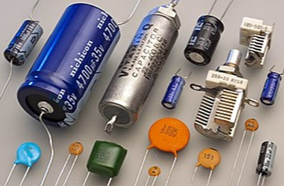
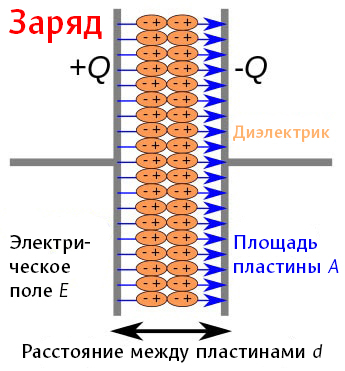
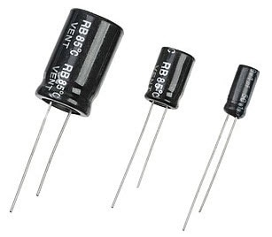
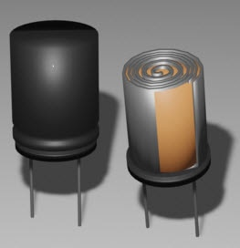
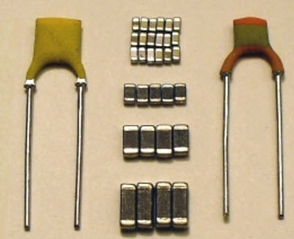
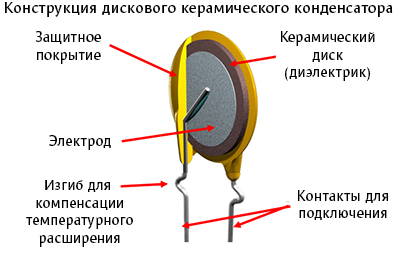
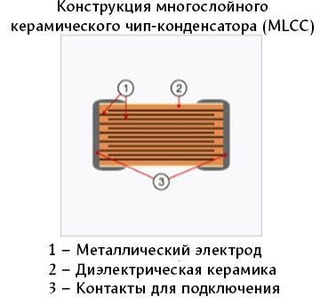

---
title: "Электролитические и керамические конденсаторы"
description: "Электролитический или керамический? Узнайте, какой тип конденсатора лучше всего подходит для вашего электронного проекта. Изучите плюсы и минусы каждого, чтобы сделать осознанный выбор."
slug: ehlektroliticheskie-i-keramicheskie-kondensatory
summary: "Мы используем блог для анонса статей или служебных заметок. Информация в них может быть не актуальной или даже не верной! Актуальную информацию смотрите в соответствующих разделах."
date: 2025-06-25T00:00:01+03:00
lastmod: 2025-11-19T00:00:02+03:00
draft: false
tags: ["Электроника", "Компоненты", "Конденсаторы"]
categories: ["Hello World"]
series: ["Настройка программ"]
# weight: 1
# aliases: ["/first"] # старая ссылка с которой нужно сделать редирект
author: "Mitulka"
# author: ["Mitulka", "Veroncher"] # multiple authors
showToc: true
TocOpen: false
hidemeta: false
comments: false
# canonicalURL: "https://canonical.url/to/page"
disableHLJS: true # to disable highlightjs
disableShare: false
hideSummary: false
searchHidden: false
ShowReadingTime: true
ShowBreadCrumbs: true
ShowPostNavLinks: true
ShowWordCount: true
ShowRssButtonInSectionTermList: true
UseHugoToc: true
cover:
  image: "/energy/ehlektroliticheskie-i-keramicheskie-kondensatory/img/cover-kondensatory.jpg" # путь к обложке поста
  alt: "Электролитические и керамические конденсаторы" # alt text
  caption: "Описание работы и устройство электролитических и керамических конденсаторов" # display caption under cover
  relative: true # when using page bundles set this to true
  hidden: false # only hide on current single page
editPost:
    URL: "https://github.com/<path_to_repo>/content"
    Text: "Suggest Changes" # edit text
    appendFilePath: true # to append file path to Edit link
---

# Конденсаторы

Давайте поговорим о конденсаторах: трубчатых компонентах, которые можно найти почти на каждой плате.

Мы будем говорить в основном о двух типах конденсаторов (или, как их называют представители нового поколения, «кондёры»), но сначала нужно разобраться, что это такое. Представьте их как крошечные электронные резервуары, которые накапливают и высвобождают электрическую энергию. Они состоят из двух проводящих пластин, разделённых изолирующим материалом, называемым диэлектриком.

Когда на пластины подаётся напряжение, они накапливают электрический заряд, подобно тому, как ведро наполняется водой. Когда напряжение снимается или цепи требуется кратковременный импульс энергии, конденсаторы высвобождают накопленный заряд, обеспечивая его в цепь, словно выливая воду из ведра.

Теперь, когда мы разобрались, что такое конденсаторы, давайте поговорим о двух самых популярных типах: электролитических и керамических.

## Электролитические конденсаторы

Электролитические конденсаторы обычно обладают очень высокой ёмкостью, что позволяет им накапливать большое количество электрической энергии. Их часто используют, когда требуется значительный резерв заряда, например, в цепях питания или аудиосистемах.

Они имеют широкий диапазон ёмкости, от микрофарад (µF) до фарад (F). Эти значения емкости являются максимальными значениями для конденсаторов.

Эти конденсаторы имеют цилиндрическую форму, напоминающую трубку. Вы можете заметить, что одна сторона короче другой — это указывает на полярность, что является уникальной особенностью электролитических конденсаторов. Неправильное подключение или путаница с полярностью может привести к тому, что конденсатор не будет работать или, в некоторых случаях, даже взорвётся. Обязательно обращайте внимание на маркировку на конденсаторе.

Внутри можно увидеть, что пластины по сути свёрнуты в аккуратную спираль. Это сильно отличается от следующего типа конденсаторов, о котором мы поговорим, — керамических конденсаторов.

## Керамические конденсаторы
Керамические конденсаторы гораздо меньше и компактнее, выглядят как небольшая пластина на концах двух выводов:

Их небольшой размер делает их оптимальными для множества приложений, и, кроме того, они неполярные, что позволяет подключать их в любом направлении.

Внутри таких конденсаторов вы найдёте множество пластин, расположенных рядом друг с другом, в отличие от свёрнутой пластины электролитического конденсатора. Меньший размер (и, соответственно, меньшая площадь поверхности) означает, что их ёмкость обычно не так велика, варьируясь от пикофарад (pF) до микрофарад (µF).

## Выбор между ними

- Самое очевидное различие заключается в том, какая ёмкость требуется для вашего проекта. Если нужен значительный резерв энергии, выбирайте электролитические конденсаторы. Для меньших задач или высокочастотных приложений чаще подходят керамические конденсаторы.
- Также важно учитывать окружающую среду. Не секрет, что электролитические конденсаторы обычно крупнее, и это нужно учитывать. Ещё один аспект — температура. Керамические конденсаторы, состоящие из нескольких пластин, более устойчивы к температурным изменениям. Электролитические конденсаторы со свёрнутыми пластинами более чувствительны к определённым температурам и могут выйти из строя.
- Ещё один фактор — частота. Керамические конденсаторы имеют более быстрое время отклика на высоких частотах. Они полезны в задачах, связанных с радиосвязью или передачей данных, а также для фильтрации шума и поддержания уровня напряжения рядом с интегральными схемами.

> В итоге, ***электролитические конденсаторы*** отлично подходят для больших значений ёмкости в широком диапазоне и в стабильной среде. ***Керамические конденсаторы*** идеальны для меньших значений ёмкости, в переменной среде или в ограниченном пространстве. Убедитесь, что вы определили свои потребности, чтобы выбрать правильный вариант!