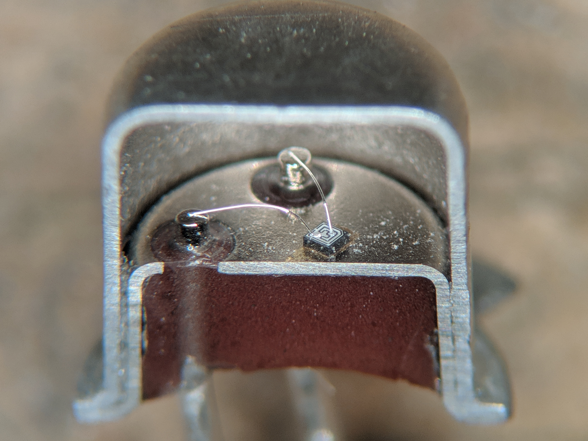

---
title: "Транзисторы"
description: "Транзисторы"
slug: tranzistory
summary: "Мы используем блог для анонса статей или служебных заметок. Информация в них может быть не актуальной или даже не верной! Актуальную информацию смотрите в соответствующих разделах."
date: 2026-01-16T00:00:01+03:00
lastmod: 2026-01-16T00:00:02+03:00
draft: false
tags: ["Электроника", "Компоненты", "Конденсаторы"]
# categories: ["Hello World"]
series: ["Настройка программ"]
# weight: 1
# aliases: ["/first"] # старая ссылка с которой нужно сделать редирект
author: "Mitulka"
# author: ["Mitulka", "Veroncher"] # multiple authors
showToc: true
TocOpen: false
hidemeta: false
comments: false
# canonicalURL: "https://canonical.url/to/page"
disableHLJS: true # to disable highlightjs
disableShare: false
hideSummary: false
searchHidden: false
ShowReadingTime: true
ShowBreadCrumbs: true
ShowPostNavLinks: true
ShowWordCount: true
ShowRssButtonInSectionTermList: true
UseHugoToc: true
cover:
  image: "/energy/tranzistory/img/cover-tranzistory.png" # путь к обложке поста
  alt: "Транзисторы" # alt text
  caption: "Транзисторы" # display caption under cover
  relative: true # when using page bundles set this to true
  hidden: false # only hide on current single page
editPost:
    URL: "https://github.com/<path_to_repo>/content"
    Text: "Suggest Changes" # edit text
    appendFilePath: true # to append file path to Edit link
---

# Транзисторы

Транзисторы являются ключевым элементом современных электронных технологий. Разработка биполярного транзистора (BJT – Bipolar Junction Transistor) привела к значительным изменениям во многих промышленных отраслях во всём мире.

Внутри металлический инкапсулированный транзистора в корпусе TO-18 представляет собой небольшой кремниевый куб с проводами, соединяющими 3 вывода, один из которых подключен к металлическому корпусу.

