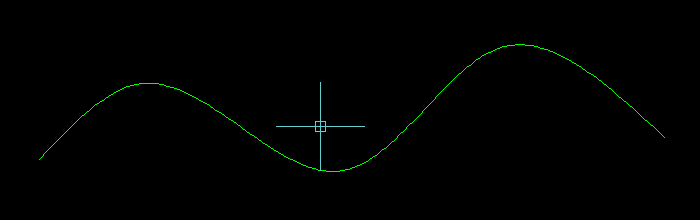

## Настройка столбцов для многострочного текстового объекта:

- **Статический**. Задаются значения ширины столбца, количества столбцов, ширины интервала между столбцами (незаполненной области между столбцами) и высоты столбца.
- **Динамический**. Задаются значения ширины столбца, ширины интервала между столбцами и высоты столбца. Количество динамических столбцов зависит от текста. Настройка столбцов влияет на поток текста, а изменение потока текста может привести к добавлению или удалению столбцов.
- **В один столбец**. Для текущего многострочного объекта режим настройки столбцов не задан.

Используемые по умолчанию параметры столбцов хранятся в системной переменной `MTEXTCOLUMN`.

## Как настроить качество изображения линий на экране в Автокаде 2015

[Как настроить качество изображения линий на экране в Автокаде 2015](https://forum.dwg.ru/showthread.php?t=117541)

[Lines display blurry, broken, or unsharp in AutoCAD products](https://knowledge.autodesk.com/support/autocad/troubleshooting/caas/sfdcarticles/sfdcarticles/Lines-display-blurry-or-unsharp-in-AutoCAD-2015.html)

Большое спасибо автору! Смешно сказать, не переходила на более поздние версии в том числе и из-за этой мутной графики. Далеко не сразу нашла эту тему, поэтому, чтобы кому-то после меня было легче: нечеткая графика, размытые линии, утолщение линий в видовых экранах...
Для AutoCAD 2016 и выше, согласно ссылке на Autodesk, нужно сначала отключить `HQGEOM` (0), а потом `LINESMOOTHING` (off). Наоборот не работает.

### Текст по дуге



[Slinky Text](http://www.lee-mac.com/slinkytext.html)

[Скачать CurvedTextV1-4](src/CurveTextV1-4.zip)

[How to Run an AutoLISP Program](https://www.lee-mac.com/runlisp.html)

View HTML Version:

{}

```html
;;--------------------=={ CurveText.lsp }==-------------------;;
;;                                                            ;;
;;  Positions Text along a curve object (arc, circle, spline, ;;
;;  ellipse, line, lwpolyline, polyline), and rotates text    ;;
;;  to fit to the curve accordingly.                          ;;
;;                                                            ;;
;;  If run in versions > AutoCAD2000, the resultant text will ;;
;;  form an anonymous group.                                  ;;
;;------------------------------------------------------------;;
;;  Author: Lee Mac, Copyright © 2012 - www.lee-mac.com       ;;
;;------------------------------------------------------------;;
;;  Version:  1.4    -    22-02-2012                          ;;
;;------------------------------------------------------------;;
 
(defun c:CurveText ( / sel str obj )
    (cond
        (   (= 4 (logand 4 (cdr (assoc 70 (tblsearch "LAYER" (getvar 'CLAYER))))))
            (princ "\nCurrent Layer Locked.")
        )
        (   (and
                (setq sel
                    (LM:SelectionOrText "\nSpecify or Select Text String: "
                        (function
                            (lambda ( x ) (wcmatch (cdr (assoc 0 (entget x))) "*TEXT,ATTRIB"))
                        )
                    )
                )
                (or
                    (and
                        (eq 'STR (type sel))
                        (setq str sel)
                    )
                    (setq str (cdr (assoc 1 (entget sel))))
                )
                (setq obj (LM:SelectIf "\nSelect Curve: " 'LM:CurveObject-p))
            )
            (LM:CurveText str obj)
        )
    )
    (princ)
)
 
(defun LM:CurveText ( str ent / *error* 3pi/2 a1 a2 a3 acdoc acspc df di dr g1 g2 gr in ln lst ms obj p1 p2 p3 pi/2 ts )
 
    (defun *error* ( msg )
        (foreach obj lst
            (if
                (and
                    (not (vlax-erased-p obj))
                    (vlax-write-enabled-p obj)
                )
                (vla-delete obj)
            )
        )
        (if (null (wcmatch (strcase msg) "*BREAK,*CANCEL*,*EXIT*"))
            (princ (strcat "\nError: " msg))
        )
        (princ)
    )
 
    (setq acdoc (vla-get-activedocument (vlax-get-acad-object))
          acspc (vlax-get-property acdoc (if (= 1 (getvar 'CVPORT)) 'paperspace 'modelspace))
    )
    (or *offset* (setq *offset* 0.0))
    (or *spacin* (setq *spacin* 1.1))
 
    (setq ts
        (/  (getvar 'textsize)
            (if (LM:isAnnotative (getvar 'textstyle))
                (cond ((getvar 'cannoscalevalue)) ( 1.0 ))
                1.0
            )
        )
    )
 
    (setq lst
        (mapcar
            (function
                (lambda ( c )
                    (setq obj (vla-addtext acspc (chr c) (vlax-3D-point (getvar 'VIEWCTR)) ts))
                    (vla-put-alignment obj acalignmentmiddlecenter)
                    obj
                )
            )
            (vl-string->list str)
        )
    )
 
    (setq ms    (princ "\nPosition Text: [+/-] Offset, [</>] Spacing")
          ln    (- (/ (1+ (strlen str)) 2.0))
          pi/2  (/ pi 2.0)
          3pi/2 (/ (* 3.0 pi) 2.0)
    )
    (while
        (progn
            (setq gr (grread t 15 0)
                  g1 (car  gr)
                  g2 (cadr gr)
            )
            (cond
                (   (or (= 05 g1) (= 03 g1))
                    (setq p1 (trans g2 1 0)
                          p2 (vlax-curve-getclosestpointto ent p1)
                          a1 (angle p2 p1)
                          di (vlax-curve-getdistatpoint ent p2)
                          dr (angle '(0.0 0.0 0.0) (vlax-curve-getfirstderiv ent (vlax-curve-getparamatpoint ent p2)))
                          df (- a1 dr)
                          in ln
                          a2 (cond
                                 (   (and (> dr pi/2) (<= dr pi))
                                     (- pi)
                                 )
                                 (   (and (> dr pi) (<= dr 3pi/2))
                                     pi
                                 )
                                 (   0.0   )
                             )
                    )
                    (foreach obj
                        (if (and (< pi/2 dr) (<= dr 3pi/2))
                            (reverse lst)
                            lst
                        )
                        (if (setq p3 (vlax-curve-getPointatDist ent (+ di (* (setq in (1+ in)) *spacin* ts))))
                            (progn
                                (setq a3 (angle '(0. 0. 0.) (vlax-curve-getfirstderiv ent (vlax-curve-getparamatpoint ent p3))))
                                (vla-put-TextAlignmentPoint obj
                                    (vlax-3D-point (polar p3 (+ a3 df) (* ts *offset*)))
                                )
                                (vla-put-rotation obj (+ a2 a3))
                            )
                        )
                    )
                    (= 05 g1)
                )
                (   (= 25 g1)
                    nil
                )
                (   (= 02 g1)
                    (cond
                        (   (member g2 '(13 32))
                            nil
                        )
                        (   (member g2 '(43 61))
                            (setq *offset* (+ *offset* 0.1))
                        )
                        (   (member g2 '(45 95))
                            (setq *offset* (- *offset* 0.1))
                        )
                        (   (member g2 '(46 62))
                            (setq *spacin* (+ *spacin* 0.05))
                        )
                        (   (member g2 '(44 60))
                            (setq *spacin* (- *spacin* 0.05))
                        )
                        (   (princ (strcat "\nInvalid Keypress." ms))
                        )
                    )
                )
                (   t  )
            )
        )        
    )
    
    (if (< 15.0 (atof (getvar 'ACADVER)))
        (vla-appenditems (vla-add (vla-get-groups acdoc) "*")
            (vlax-make-variant
                (vlax-safearray-fill
                    (vlax-make-safearray vlax-vbObject (cons 0 (1- (length lst))))
                    lst
                )
            )
        )
    )
    (princ)
)
 
(defun LM:CurveObject-p ( ent )
    (null
        (vl-catch-all-error-p
            (vl-catch-all-apply 'vlax-curve-getEndParam (list ent))
        )
    )
)
 
(defun LM:SelectIf ( msg pred )
    (
        (lambda ( f / e )
            (while
                (progn (setvar 'ERRNO 0) (setq e (car (entsel msg)))
                    (cond
                        (   (= 7 (getvar 'ERRNO))
                            (princ "\nMissed, try again.")
                        )
                        (   (eq 'ENAME (type e))
                            (if (and f (null (f e)))
                                (princ "\nInvalid Object.")
                            )
                        )
                    )
                )
            )
            e
        )
        (eval pred)
    )
)
 
(defun LM:isAnnotative ( style / obj xdt )
    (and
        (setq obj (tblobjname "STYLE" style))
        (setq xdt (cadr (assoc -3 (entget obj '("AcadAnnotative")))))
        (= 1 (cdr (assoc 1070 (reverse xdt))))
    )
)
 
(defun LM:SelectionOrText ( msg pred / en g1 g2 gr result )
    (setq pred (eval pred))
    
    (if msg
        (princ msg)
        (princ (setq msg "\nSelect Objects or Enter Text: "))
    )
    (setq result "")
 
    (while
        (progn
            (setq gr (grread t 13 2)
                  g1 (car  gr)
                  g2 (cadr gr)
            )
            (cond
                (   (= 03 g1)
                    (if (setq en (car (nentselp g2)))
                        (if (pred en)
                            (not (setq result en))
                            (princ (strcat "\nInvalid Object Selected." msg))
                        )
                        (princ (strcat "\nMissed, try again." msg))
                    )
                )
                (   (= 02 g1)
                    (cond
                        (   (< 31 g2 127)
                            (setq result (strcat result (princ (chr g2))))
                        )
                        (   (= 13 g2)
                            nil
                        )
                        (   (= 08 g2)
                            (if (< 0 (strlen result))
                                (progn
                                    (setq result (substr result 1 (1- (strlen result))))
                                    (princ (vl-list->string '(8 32 8)))
                                )
                            )
                            t
                        )
                        (   t   )
                    )
                )
                (   (= 25 g1)
                    nil
                )
                (   t   )
            )
        )
    )
    result
)
 
(vl-load-com)
(princ "\n:: CurveText.lsp | Version 1.4 | © Lee Mac 2012 www.lee-mac.com ::")
(princ "\n:: Type \"CurveText\" to Invoke ::")
(princ)
```

{}

## Почему тормозит AutoCAD 20ХХ?

[Почему тормозит AutoCAD 20ХХ?](https://forum.dwg.ru/showthread.php?t=72856&page=37)

#### Проблема

Чертежи AutoCAD, содержащие большие объемы текста или люков, могут ухудшить производительность. В большинстве случаев это связано с более старыми или низкоуровневыми видеокартами, однако в зависимости от объема отображаемых данных могут быть затронуты также графические карты высокого класса.

#### Причина

Причины
Несколько новых системных переменных были введены с AutoCAD 2015. Эти переменные будут отображать информацию о наборах наборов в палитре свойств или объектах с высокой освещенностью при выборе или зависании. Это может повлиять на производительность некоторых графических карт.

#### Решение
- Закройте панель свойств, пока она не понадобится.
- Измените следующие переменные в AutoCAD (введите их в командной строке):
  - `SELECTIONCYCLING` = `0`
  - `UCSDETECT` = `0`
  - `ORTHOMODE` = `0`
  - `DYNMODE` = `0`
  - `ROLLOVERTIPS` = `0`
  - `SAVEFIDELITY` = `0`
  - `QPMODE` = `0`
  - `SNAPMODE` = `0`
  - `SELECTIONPREVIEW` = `0`
  - `PROPERTYPREVIEW` = `0`
  - `COMMANDPREVIEW` = `0`
  - `ANNOALLVISIBLE` = `0`
  - `WHIPTHREAD` = `3`
  - `ISAVEPERCENT` = `0`
  - `REGENMODE` = `0`
  - `PALETTEOPAQUE` = `1`
  - `DRAWORDERCTL` = `0`
  - `LAYOUTREGENCTL` = `0` или `1`
  - `QPMODE` = `0`

Если вы работаете в ОС Windows Vista или Windows 7, попробуйте отключить Aero, изменив тему рабочего стола на «Упрощенный стиль Windows».

## Тормозит штриховка
В более поздних версиях AutoCAD предварительный просмотр штриховки по умолчанию открывается при наведении перекрестья на замкнутую область. Это может замедлять работу с большими чертежами.  
Чтобы отключить функцию:
1. В любом чертеже введите `HPQUICKPREVIEW` и нажмите `ENTER`.
2. Введите `OFF` или `0` и нажмите `ENTER`.

## Как отключить рамку вокруг изображения в AutoCAD
Переменная `IMAGEFRAME` установлена в `1`.  
1. Введите `IMAGEFRAME` в командной строке и нажмите `Enter`.
2. Введите `0` (для полного удаления границы) или `2` (граница отображается, но не печатается).  
**UPD**: Если рамка не исчезает, установите `IMAGEFRAME` в `1`, затем в `0`.