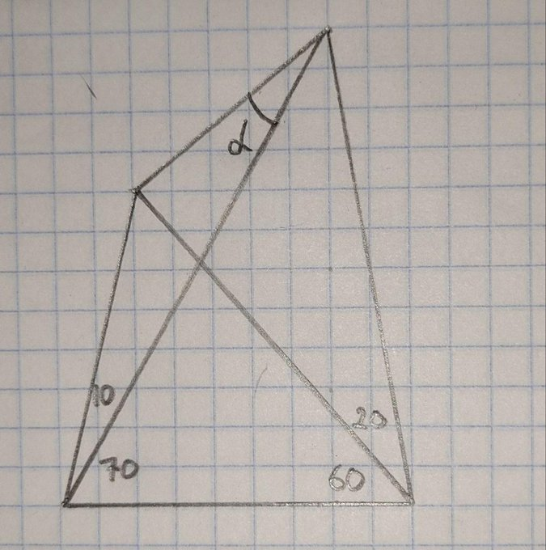
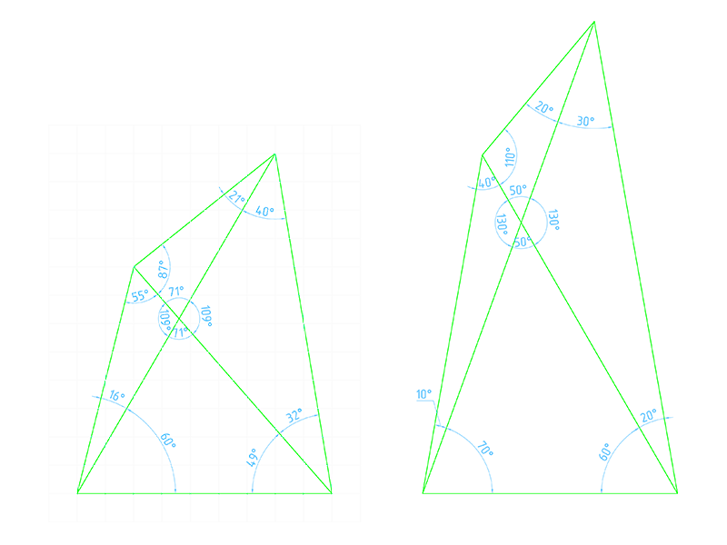

---
title: "Hello, Dump!"
description: "Свалка"
slug: dump
summary: "Мы используем блог для анонса статей или служебных заметок. Информация в них может быть не актуальной или даже не верной! Актуальную информацию смотрите в соответствующих разделах."
date: 2026-07-14T00:00:01+03:00
lastmod: 2026-07-14T00:00:02+03:00
draft: false
tags: ["dump", "свалка"]
# categories: ["Hello World"]
# series: ["Настройка программ"]
weight: 1
# aliases: ["/first"] # старая ссылка с которой нужно сделать редирект
author: "Mitulka"
# author: ["Mitulka", "Veroncher"] # multiple authors
showToc: true
TocOpen: true
hidemeta: false
comments: false
# canonicalURL: "https://canonical.url/to/page"
disableHLJS: true # to disable highlightjs
disableShare: false
hideSummary: false
searchHidden: false
ShowReadingTime: true
ShowBreadCrumbs: true
ShowPostNavLinks: true
ShowWordCount: true
ShowRssButtonInSectionTermList: true
UseHugoToc: true
cover:
  image: "/posts/dump/img/dump-cover.png" # путь к обложке поста
  alt: "Dump" # alt text
  caption: "Dump" # display caption under cover
  relative: true # when using page bundles set this to true
  hidden: false # only hide on current single page
editPost:
    URL: "https://github.com/<path_to_repo>/content"
    Text: "Suggest Changes" # edit text
    appendFilePath: true # to append file path to Edit link
---

## Задачка поиск угла от Трушина

> https://x.com/TrushinBV/status/2076381449142309108

Решение:

Если построить «по клеточкам» как в задании, то угол приблизительно 21°, если построить по углам, то точно 20°

***Решайте задачи, а не создавайте из них проблем!***