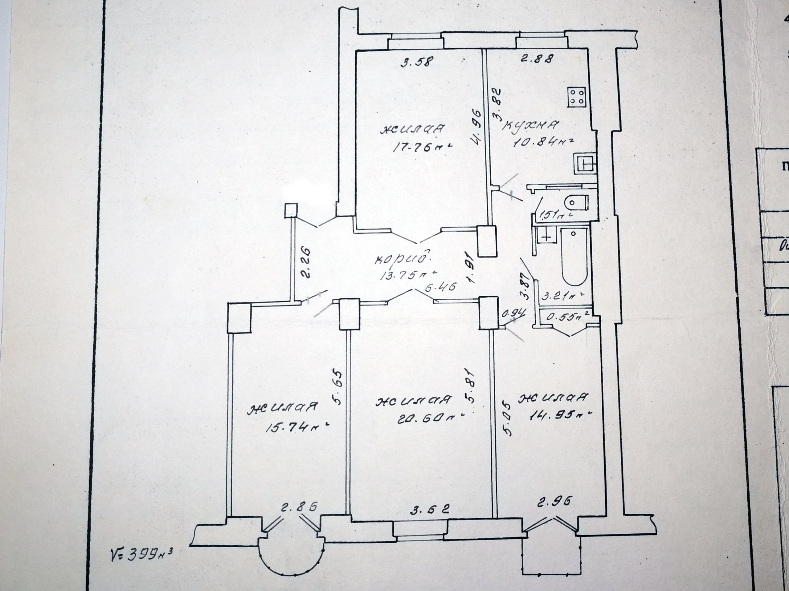

### Кадастровый номер 
500/D-84575

### Характеристики квартиры
- Этаж: 3/4
- Общая: 98,9 м2
- Жилая: 69,1 м2
- Кухня: 10,8 м2
- Капитальный ремонт 2023 года!
- Вторичка с ремонтом;
- Кирпичный дом 1952 года;
- С двумя балконами (лоджией);
- Без выделенного парковочного места;
- Потолки 3 метра;

### Общее описание
Просторная 4-х комнатная квартира, на 3 этаже, 2 балкона, 2 с/у, 2 телефонные линии, метро — 1 минута ходьбы, развитая инфраструктура, собственник, чистая продажа.

Цена: $$$

+375 29 148 56 43 Дмитрий

### Фотографии
