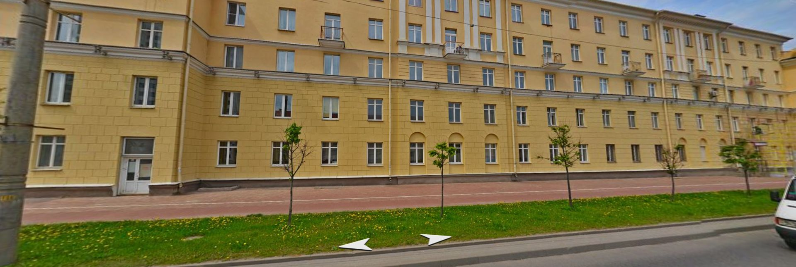
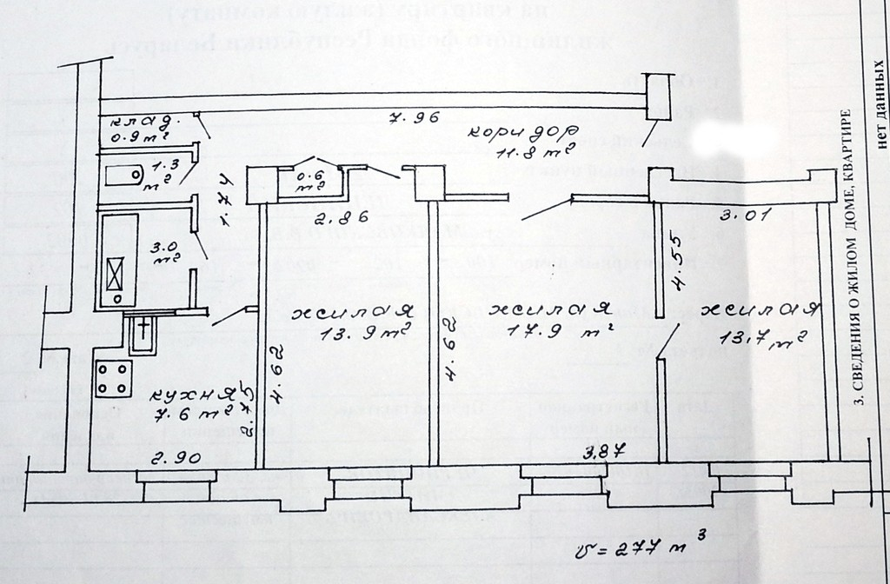
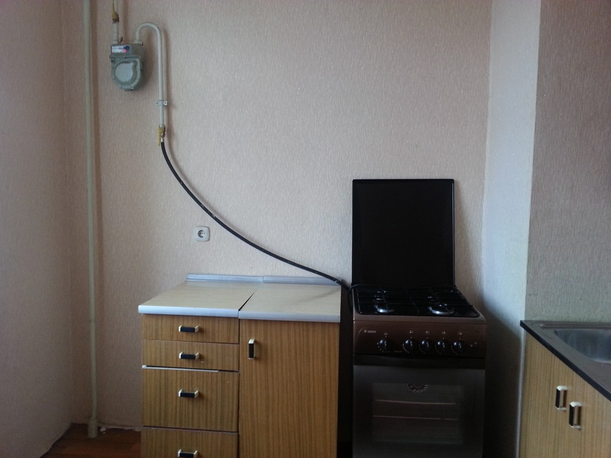
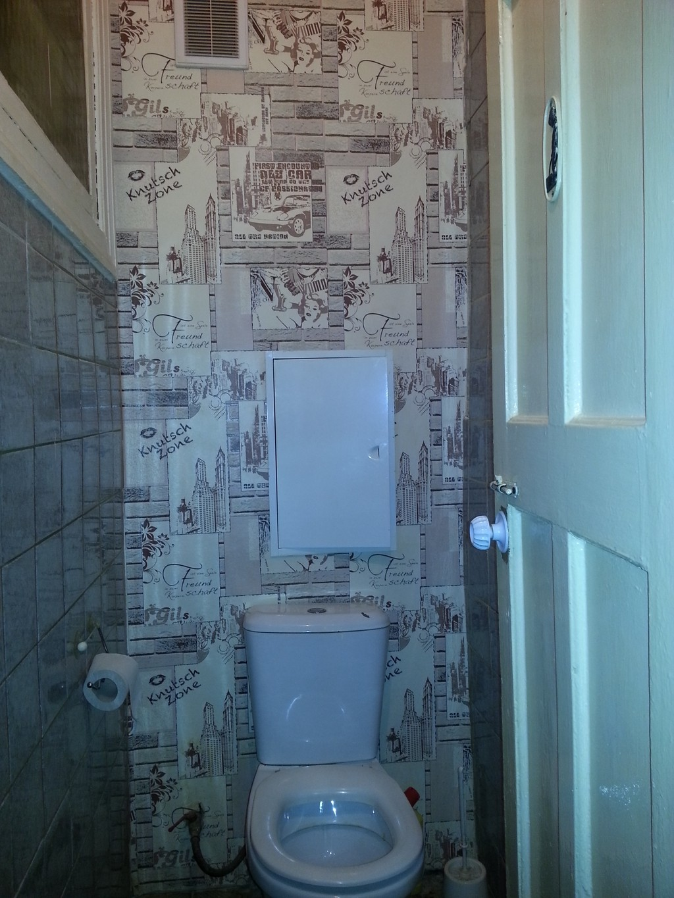

### Кадастровый номер
500/D-80382

### Характеристики квартиры
- Этаж: 2/5
- Общая: 70,7 м2
- Жилая: 45,5 м2
- Кухня: 7,6 м2
- Вторичка с ремонтом;
- Кирпичный дом 1958 года;
- Без выделенного парковочного места;
- Потолки 2,9 метра
- метро «Аэродромная»

### Общее описание
Просторная 3-х комнатная квартира «Сталинка», на 2 этаже 5 этажного кирпичного дома, раздельный с/у, телефонная линия, ж/д (центр) — 10 минут на транспорте, год кап. ремонта 2015, развитая инфраструктура, 10 минут прогулочным шагом и вы в Лошицком парке! Собственник, чистая продажа.
Минск, улица Маяковского, 160

***Агенствам просьба не беспокоить!***

Цена: $$$

### Фотографии

+375 29 148 56 43 Дмитрий