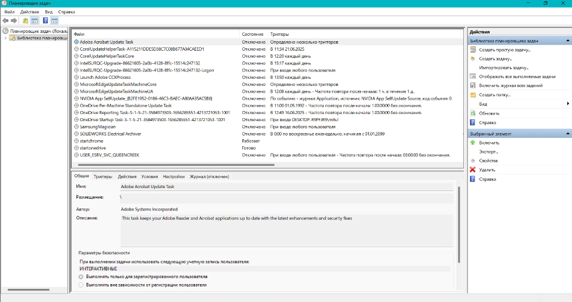
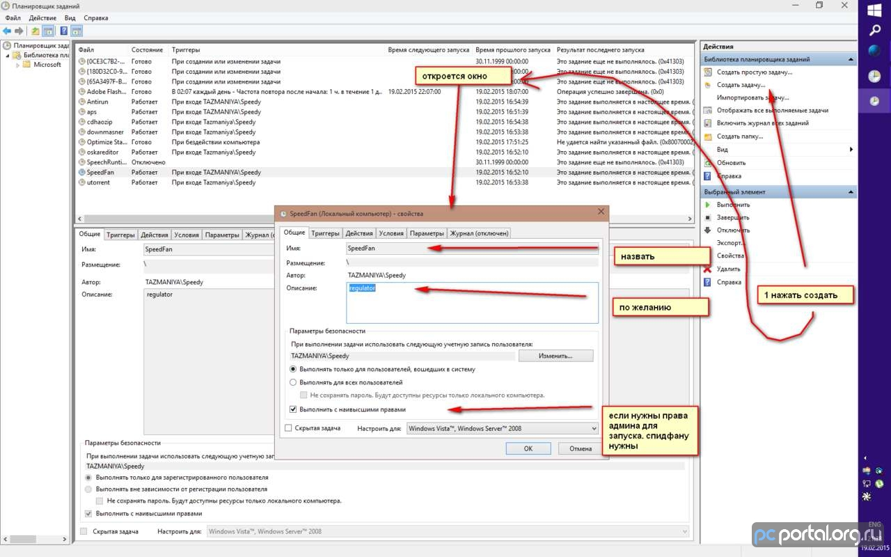
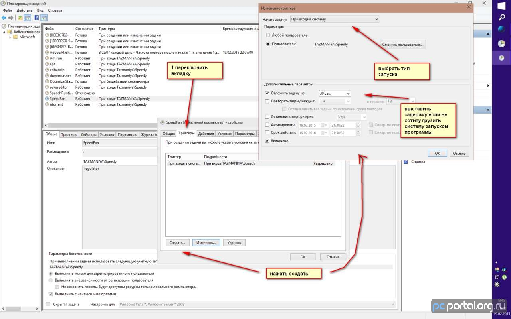
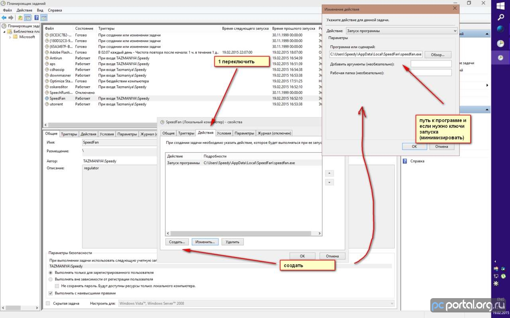
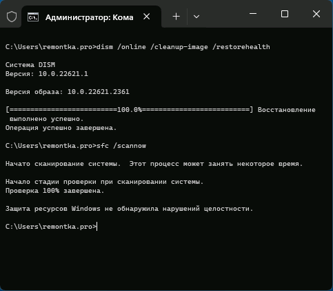
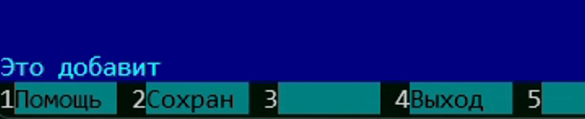

## Инициализация удаленного репозитория Git

```
git remote add hoster ssh://gorshoch@gorshochek.by/home/gorshoch/public_html/lyasne.by
git push -u hoster main
```

## Как запустить «Планировщик задач» и сделать автозагрузку приложения

- Нажимаем кнопку *«Пуск»* вводим **«Планировщик заданий»**, после его появления нажимаем на него.
- Вызываем окно *«Выполнить»* нажав **Win+R** и вводим в нем команду ```taskschd.msc```
- Нажимаем правой кнопкой мыши на кнопку *«Пуск»* и в выпадающем меню выбираем **«Управление компьютером»**. Щелкаем по узлу **«Служебные программы»** и там находим **«Планировщик заданий»**.



### Три простых шага для автозапуска приложения:

  - Шаг 1 Создаем новую задачу

    

  - Шаг 2 Добавляем триггер запуска

    

  - Шаг 3 Указываем действие для задачи

    

## Проверка и восстановление системных файлов
Следующий возможный метод решения проблемы — восстановление системных файлов Windows.

### Необходимые шаги:

- Запустите командную строку от имени администратора: если это не получается сделать стандартными методами, откройте диспетчер задач, нажмите «Запустить новую задачу», введите cmd и отметьте опцию запуска от имени администратора.
- По порядку введите следующие две команды:

```
DISM /Online /Cleanup-Image /RestoreHealth
```

```
sfc /scannow
```

Исправление ошибок системных файлов Windows



Если в результате вы получили информацию о том, что повреждения были обнаружены и исправлены, перезагрузите компьютер и проверьте, решило ли это проблему.

> Учитывайте, что выполнение первой из команд может занять продолжительное время и «зависать» в процессе, дождитесь завершения.

## Total Commander

### Настройка стрелок как PageUp/PageDown

- Открыть файл конфигурации: `Конфигурация \ Редактировать файлы конфигурации`
- Открывается 2 файла: `wincmd.ini`, `wcx_ftp.ini`
- В `wincmd.ini` после `[Configuration]` добавить:

```html
  SpecialCursorMovement=9
```

- Перезапустить Total Commander

## Far Manager

### Настройка плагина EditWrap — виртуальный перенос строк в редакторе

- [Скачать](https://plugring.farmanager.com/plugin.php?pid=951&l=ru) и установить плагин EditWrap

- Открыть папку с установленным плагином. Стандартный путь установки: C:\Program Files\Far Manager\Plugins\EditWrap.1.9\ найти и открыть файл KeyBar.farconfig

- Сохранить его как: Thumbnails_KeyBar.xml

- Выполнить команду

```
"%FARHOME%\Far.exe" /import Thumbnails_KeyBar.xml
```

- Это добавит кнопку VWWrap при нажатии на Shift:



- Запишите макрос для запуска команды Toggle word wrap плагина WordWrap согласно [официальной документации](https://api.farmanager.com/ru/macro/macrokey/record.html)

> Теперь при нажатии на <kbd>Shift</kbd> + <kbd>F3</kbd> будет осуществлятся перенос виртуальных строк на экране в редакторе FAR