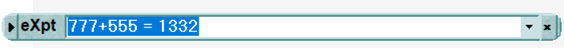

---
title: "Удобный калькулятор вызываемый по клавише NumLock"
description: "Удобный калькулятор NumLock Calculator"
slug: num-lock-calculator
summary: ""
date: 2022-03-01T00:00:01+03:00
lastmod: 2022-03-01T00:00:02+03:00
draft: false
categories: ["Инструменты"]
tags: ["tools", "калькулятор"]
series: ["Программы"]
# weight: 1
# aliases: ["/first"] # старая ссылка с которой нужно сделать редирект
author: "Mitulka"
# author: ["Mitulka", "Veroncher"] # multiple authors
showToc: true
TocOpen: false
hidemeta: false
comments: false
# canonicalURL: "https://canonical.url/to/page"
disableHLJS: true # to disable highlightjs
disableShare: false
hideSummary: false
searchHidden: false
ShowReadingTime: true
ShowBreadCrumbs: true
ShowPostNavLinks: true
ShowWordCount: true
ShowRssButtonInSectionTermList: true
UseHugoToc: true
cover:
  image: "/tools/num-lock-calculator/img/cover-num-lock-calculator.gif" # путь к обложке поста
  alt: "Links" # alt text
  caption: "Каталог ссылок" # display caption under cover
  relative: true # when using page bundles set this to true
  hidden: false # only hide on current single page
editPost:
    URL: "https://github.com/<path_to_repo>/content"
    Text: "Suggest Changes" # edit text
    appendFilePath: true # to append file path to Edit link
---

### NumLock Calculator
Очень удобный калькулятор для Windows который вызывается по клавише NumLock. Я использую его в форме эксперт — просто строка для вычислений. Всем рекомендую.

[Страница автора](https://nlcalc.narod.ru/)

[Скачать ссылка 1](src/num-lock-calculator.zip)

[Скачать ссылка 2](https://drive.google.com/file/d/1A6zmd2RiQZlcjXC-PRd2GP66OsyoHp9a/view?usp=sharing)

> Запускайте программу от имени администратора!