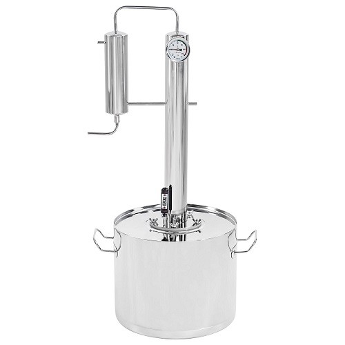

---
title: "Процесс дистилляции Меркель-PRO"
description: "Процесс дистилляции в бытовом дистилляторе Меркель-PRO (памятка)"
slug: process-distillyacii-merkel-pro
summary: "В итоге, вы победите!"
date: 2022-07-12T00:00:01+02:00
lastmod: 2022-07-12T00:00:02+02:00
draft: false
categories: ["Инструменты"]
tags: ["рецепт", "самогон", "брага", "самогонный аппарат", "спирт", "спирт сырец"]
series: ["Инструменты и инструкции"]
# weight: 1
# aliases: ["/first"] # старая ссылка с которой нужно сделать редирект
author: "Mitulka"
# author: ["Mitulka", "Veroncher"] # multiple authors
showToc: true
TocOpen: false
hidemeta: false
comments: false
# canonicalURL: "https://canonical.url/to/page"
disableHLJS: false # to disable highlightjs
disableShare: false
hideSummary: false
searchHidden: false
ShowReadingTime: true
ShowBreadCrumbs: true
ShowPostNavLinks: true
ShowWordCount: true
ShowRssButtonInSectionTermList: true
UseHugoToc: true
cover:
  image: "/tools/process-distillyacii-merkel-pro/img/cover-process-distillyacii-merkel-pro.jpg" # путь к обложке поста
  alt: "Процесс дистилляции в бытовом дистилляторе Меркель-PRO" # alt text
  caption: "Процесс дистилляции в бытовом дистилляторе Меркель-PRO" # display caption under cover
  relative: false # when using page bundles set this to true
  hidden: false # only hide on current single page
editPost:
    URL: "https://github.com/<path_to_repo>/content"
    Text: "Suggest Changes" # edit text
    appendFilePath: true # to append file path to Edit link
---

12 июля 2022

## Процесс дистилляции в бытовом дистилляторе Меркель-PRO (памятка)

### Шаг 1. Пропорции смешивания 
Смешать в дистилляторе 6 литров изделия первой перегонки (спирт сырец) + 6 литров холодной воды.
### Шаг 2. Предварительно нагреваем
Включить плиту, не подавая холодную воду нагревать до 60 °С по термометру в баке. Время **20 минут** (можно использовать таймер).
### Шаг 3. Подачём охлаждающую жидкость
Включить подачу охлаждающей воды. Продолжить нагревать до *80 °С по термометру в баке* (температура на термометре ректификационной колонны будет быстро подниматься до 60 °С) Приблизительное время **10 минут (контролировать процесс)!** Уменьшить нагрев сразу после начала процесса выгонки (потекла струйка).
### Шаг 4. «Снимаем головы»
Регулировкой температуры добиться расхода 1-2 капли в секунду. Время приблизительно **30 минут** (можно использовать таймер). Объем «голов» 150 мл. Температура для справки: бак — 85 °С, колонна — 70 °С
### Шаг 5. «Выгоняем тело» 
Установить максимальную температуру нагрева. Время выгонки **1 час 10 минут** (можно использовать таймер). Объем выгонки — 3 литра.
### Шаг 6. «Убираем хвосты»
Продолжаем процесс выгонки в отдельную тару до температуры в баке 98-99 °С или до практически полного останова процесса выгонки. Приблизительное время 10 — 15 минут.

> UPD: Фармацевтической мерой капли принято считать: для водных растворов — 0,05 мл, таким образом 20 капель есть 1 мл.