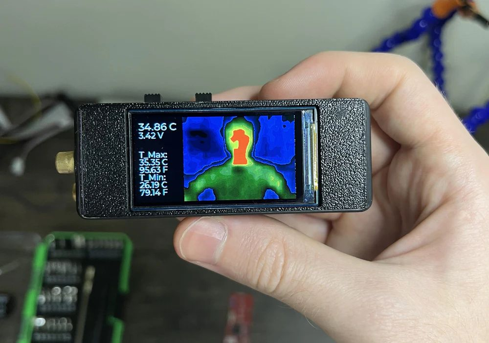

# Тепловизор

- [High Precision Thermal Imager + Infrared Thermometer! | Pocket-Sized Thermal Sensing | OpenTemp (How To)2](https://roboticworx.io/blogs/projects/opentemp-thermal-imager-infrared-thermometer)

- [ESP32 + MLX90640: тепловизор с искусственным интеллектом](https://habr.com/ru/articles/970216/)