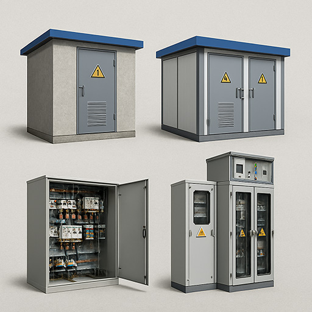

<!--

-->

<!--

-->

<!--
<noscript>
  
</noscript>
-->

<!-- Основной контейнер для контента -->
<!-- <main> -->
<!--  
 -->

# 📘 Бизнес-план: Производство КТП, НКУ, КСО, КРУ

## 1. Резюме проекта

> Краткое описание идеи, цели компании, ключевые продукты, целевая аудитория, ожидаемые результаты.

### Этап 1. Изготовление высоковольтного оборудования
  - Изготовление современного оборудования распределения электроэнергии напряжением 6-10кВ и 20кВ. Модульные, быстромонтируемые трансформаторные подстанции с применением корпусов из металлических сэндвич панелей для обоспечения простоты монтажа и соответствия различным климатическим условиям.
  - Изготовление сопутствующего оборудования РУНН 0,4кВ; РУВН 6-10кВ и 20 кВ, а также необходимого телекоммуникационного и электроснабжающего оборудования.

### Этап 2. Изготовление сэндвичпанелей
  - Производство металлических сэндвич панелей для собственных нужд и реализации на потребительском рынке.

## 2. Описание продукции
  - КТП в бетонной оболочке
  - КТП в оболочке из сэндвич-панелей
  - НКУ (низковольтные комплектные устройства)
  - КСО (камеры сборные одностороннего обслуживания)
  - КРУ (комплектные распределительные устройства) 
  <!-- 3d модели [Элтехника](https://www.elteh.ru/models) -->
  - Особенности, преимущества, сертификация

## 3. Анализ рынка

### 3.1 Целевая аудитория
  - Промышленные предприятия РБ
  - Предприятия строительной сферы РБ
  - Промышленные предприятие РФ
  - Предприятия строительной сферы РФ

### 3.2 География продаж
  - Производство и продажа на территории Республики Беларусь
  - Через два года устойчивых продаж на рынке РБ выход на рынок Российской Федерации
  - Выход на ранок стран СНГ

### 3.3 Текущие тенденции
  - Внедрение телемеханизации, телеуправления, телесигнализации
  - Цифровизация подстанций и оборудования
  - Уменьшение габаритов изделий
  - Повышение сроков эксплуатации оборудования.

### 3.4 Основные конкуренты
  - На рынке Республики Беларусь
    - ООО «Легир Плюс»
    - ООО «Промсвязьдеталь»
    - ООО «Завод распределительных устройств» 
    - СЗАО «РУЭЛТА»
    - ООО «Таврида Электрик» 

### 3.5 SWOT-анализ

## 4. Производственный план

### 4.1 Этапы производства

- **Конструкторская документация (собственное производство)**
  - Технические условия и документация необходимая для сертификации и аттестации
  - Компоновка основного оборудования, чертежи деталей из листового металла и металлоконструкции, сборочные чертежи 
  - Опросные листы, однолинейные электрические схемы (Э6), принципиальные электрические схемы (Э3), схемы подключения оборудования (Э4), таблицы соединений (ТЭ4)
  - Исполнительная документация и изготовление комплекта бирок для подключения приборов и оборудования
  - Паспорта, руководства по эксплуатации, ведомости комплектации и ЗИП

- **Производственные работы**
  - Изготовления оснований и несущих конструкций, сварочные работы (***собственное производство***)
  - Покраска оснований и несущих конструкций (полимерная или пневматическая) (*подрядная организация* или ***собственное производство***)
  - Изготовление деталей из листового металла и оцинкованного листового металла (*подрядная организация*)
  - Полимерная покраска деталей из листового металла (*подрядная организация*)
  - Изготовление комплекта ошиновки (***собственное производство***)
  - Сборка каркасов и отсеков электротехнического оборудования (***собственное производство***)
  - Установка основного оборудования на каркасы (***собственное производство***)
  - Ошиновка основного оборудования (***собственное производство***)
  - Монтаж электрических соединений и жгутов в каркасах (***собственное производство***)
  - Изготовление монтажных панелей (***собственное производство***)
  - Установка монтажных панелей, навеска дверей, установка приборов, блокировок и световой индикации (***собственное производство***)
  - Наладка приводов и окончательный монтаж электрических соединений (***собственное производство***)
  - Установка обшивок и сборка отдельных шкафов в секции (***собственное производство***)
  - Изготовление и нанесение знаков электробезопасности, мнемосхем и наклеек (***собственное производство***)
  - Монтаж секций в КТП, монтаж собственных нужд КТП (***собственное производство***)
  - Наладка и проведение необходимых испытаний (*подрядная организация* и/или ***собственное производство***)
  - Упаковка и транспортировка оборудования (*подрядная организация* и/или ***собственное производство***)

### 4.2 Локация производства

- **Административно-бытовые помещения**
  - Офисные помещения: ***20 – 40*** *м2*
  - Комната приема пищи: ***20*** *м2*
  - Гардеробное помещение: ***10*** *м2*
  - С/у и душевая: ***10*** *м2*

- **Производственные площади и помещения**
  - Производственное помещение площадью **200** *м2* для сборки электрощитового оборудования 
  - Производственное помещение ***100*** *м2* для организации сварочного участка и хранения сортового металла
  - Производственное помещение ***50*** *м2* для организации покрасочного участка
  - Открытая площадка с твердым покрытием ***200*** *м2*

### 4.3 Необходимые материалы и оборудование

- **Офисное оборудование**
  - Компьютеры инженера-конструктора (механика)
  - Компьютеры инженера-конструктора (электрика)
  - Принтер для печати бирок
  - Ноутбук руководителя
  - Компьютер бухгалтера
  - Компьютер офисного работника
  - Сервер
  - МФУ *формат А3*
  - Принтер *формат А4*
  - Сетевое оборудование
  - Кондиционер
  - Столы, стулья
  - Шкафы, вешалки
  - Кулер
  - Офисные принадлежности
  - Бланки строгой отчетности
  - Дырокол :blush:

- **Производственное оборудование**
  - Компрессор ***650*** *л/мин*, вентиляционная вытяжная система, краскопульты. 
  - Сварочный полуавтоматический аппарат ***250*** *А*, баллоны для СО2, сварочная тележка, сварочный стол, струбцины и упоры, организация вытяжной системы, системы пожаротушения, изготовление ограждений, расходные материалы и СИЗ
  - Инструменты и приспособления для обработки шин (гибка, резка, пробивка отверстий, зачистка и шлифовка)
  - Прессы гидравлические для опрессовки наконечников и гильз
  - Кондиционер
  - Резервный генератор
  - Системы хранения (шкафы и стеллажи)
  - Сборочные столы электромонтажников
  - Слесарный верстак (оборудованный тисками и слесарным инструментом)
  - Ноутбук

- **Инструмент**

  - *Ручной инструмент*:
    - УШМ
    - Дрель-шуруповерт
    - Пила монтажная
    - Струбцины и зажимы
    - Динамометрический ключ *(поверенный)*
    - Линейки *(повереные)*
    - Рулетки *(поверенные)*
    - Штанген-циркуль *(поверенный)*
    - Индивидуальные наборы инструментов слесаря
    - Индивидуальные наборы инструментов электромонтажника
    - Лестница стремянка

  - *Пневмотический инструмент*:
    - Пневмозаклепочник
    - Пневмогайковерт
    - Краскопульты
    - Обустройство покрасочного участка (вытяжка, тент, стойки)

  - *Транспортное и погрузочное оборудование*
    - Электропогрузчик
    - Рохля
    - Стропы
    - Бортовой а/м
    - Микроавтобус пассажирский
    - Легковой а/м универсал

- **Материалы**
  - Крепеж и метизы
  - Спецодежда и СИЗ
  - Шина медная
  - Шина алюминиевая
  - Сортовой металл

- **Специальное программное обеспечение**
  - 1С УНФ
  - SolidWorks
  - Eplan

- **Интернет, телекоммуникации и маркетинг**
  - Доменное имя (1 год)
  - Хостинг (1 год)
  - Сайт
  - Дизайн и наполнение сайта
  - Каталоги и промопродукция
  - Телефон стационарный (1 год)
  - Телефон сотовый
  - Интернет доступ (1 год)
  - Проектор и экран

### 4.4 Поставщики материалов

### 4.5 Логистика и складирование

## 5. Организационный план

### 5.1 Юридическая форма
- Регистрация ООО
- Получение сертификата собственного производства
- Регистрация технических условий
- Назначение кода организации-разработчика

### 5.2 Структура компании
- Администрация
- Конструкторский отдел
- Производственный участок
- Склад и логистика

### 5.3 Ключевые сотрудники и план найма

**1-3 месяц:**
 
  1. Директор
 
  2. Главный инженер

  3. Главный бухгалтер

  4. Юрист

**3-6 месяцы:**

  5. Офис менеджер, HR

  6. Менеджер по ключевым клиентам

  7. Ведущий инженер-конструктор (механик)

  8. Ведущий инженер-конструктор (электрик)

  9. Слесарь-механик

  10. Слесарь-электрик

**6-12 месяцы:**
  
  11. Слесарь-механик
  
  12. Слесарь-электрик

  13. Инженер по ОТ и ТБ

  14. Снабженец

**12-24 месяцы:**
  
  15. Начальник конструкторского отдела

  16. Инженер-конструктор (механик)

  17. Инженер-конструктор (электрик)

  18. Начальник склада

  19. Бухгалтер на первичную документацию

  20. Начальник производства (з/п месяц)

  21. Сварщик (з/п месяц, 1/2 ставки)

  22. Маляр (з/п месяц, 1/2 ставки )

  23. Кладовщик (з/п месяц)

  24. Водитель (з/п месяц)
  
### 5.4 Партнёры и подрядчики

## 6. Финансовый план

  - ***Первый этап*** от создания предприятия до первых 6 месяцев «Начальный уровень»

  - ***Второй этап*** 6 - 12 месяцев рост производства и продаж «Рост производства и продаж»

  - ***Третий этап*** 12 - 24 месяцев выход предприятия на полную мощность «Выход предприятия на полную мощность»

### 6.1 Стартовые инвестиции в материалы и оборудование

**Таблица 6.1 Офисное оборудование**



**Таблица 6.2 Производственное оборудование**



- **Таблица 6.3 Ручной инструмент**



- **Таблица 6.4 Пневматический инструмент**:



- **Таблица 6.5 Транспортное и погрузочное оборудование**



- **Таблица 6.6 Материалы**



- **Таблица 6.7 Специальное программное обеспечение**



- **Таблица 6.8 Интернет, телекоммуникации и маркетинг**



**ВСЕГО НЕОБХОДИМЫЕ МАТЕРИАЛЫ И ОБОРУДОВАНИЕ** <mark style="background: red">**78450$**</mark>

### 6.2 Операционные расходы для первого этапа первые 6 месяцев «Начальный уровень»

- **Административно-бытовые помещения**

  - Офисные помещения (юридический адрес): ***20*** *м2* - <mark>**50$**</mark>

- **Производственные площади и помещения**

  - Производственное помещение площадью **200** *м2* для сборки электрощитового оборудования <mark>**1000$**</mark>

**ВСЕГО АРЕНДА ЗА ПЕРВЫЕ 6 МЕСЯЦЕВ:** <mark style="background: #7CFC00">**1050\$** * **6 месяцев** = **6300\$**</mark>

- **Сотрудники**

<!-- Добавляем CSS для отступов между строками -->

<ol id="salaries-list">
  <li>Директор (з/п месяц)
    <mark id="1" style="background: #7CFC00"><strong></strong></mark>
  </li>
  <li>Главный инженер (з/п месяц)
    <mark id="2" style="background: #7CFC00"><strong></strong></mark>
  </li>
  <li>Главный бухгалтер (з/п месяц аутсорсинг)
    <mark id="3" style="background: #7CFC00"><strong></strong></mark>
  </li>
  <li>Юрист (з/п месяц аутсорсинг)
    <mark id="4" style="background: #7CFC00"><strong></strong></mark>
  </li>
  <li>Офис менеджер, HR (з/п месяц аутсорсинг)
    <mark id="5" style="background: #7CFC00"><strong></strong></mark>
  </li>
  <li>Менеджер по ключевым клиентам (з/п месяц)
    <mark id="6" style="background: #7CFC00"><strong></strong></mark>
  </li>
  <li>Ведущий инженер-конструктор (механик) (з/п месяц аутсорсинг)
    <mark id="7" style="background: #7CFC00"><strong></strong></mark>
  </li>
  <li>Ведущий инженер-конструктор (электрик) (з/п месяц аутсорсинг)
    <mark id="8" style="background: #7CFC00"><strong></strong></mark>
  </li>
  <li>Слесарь-механик (1 бригада) (з/п месяц аутсорсинг)
    <mark id="9" style="background: #7CFC00"><strong></strong></mark>
  </li>
  <li>Слесарь-электрик (1 бригада) (з/п месяц аутсорсинг)
    <mark id="10" style="background: #7CFC00"><strong></strong></mark>
  </li>
</ol>

**ВСЕГО НАЛОГИ ЗА ПЕРВЫЕ 6 МЕСЯЦЕВ (~40% от фонда З/П)** <mark style="background: #7CFC00">**11000\$**</mark>

### 6.3 Операционные расходы второй этап 6 - 12 месяцев «Рост производства и продаж» 

- **Административно-бытовые помещения**

  - Офисные помещения: ***40*** *м2* - <mark>**200$**</mark>

  - Комната приема пищи: ***20*** *м2* - <mark>**100$**</mark>

  - Гардеробное помещение: ***10*** *м2* - <mark>**50$**</mark>

  - С/у и душевая: ***10*** *м2* - <mark>**50$**</mark>

- **Производственные площади и помещения**

  - Производственное помещение площадью **200** *м2* для сборки электрощитового оборудования <mark>**1000$**</mark> 

  - Производственное помещение ***100*** *м2* для организации сварочного участка и хранения сортового металла <mark>**500$**</mark>

  - Производственное помещение ***50*** *м2* для организации покрасочного участка <mark>**250$**</mark>

  - Открытая площадка с твердым покрытием ***200*** *м2* <mark>**300$**</mark>

**ВСЕГО АРЕНДА ЗА 6 - 12 МЕСЯЦЕВ:** <mark style="background: #7CFC00">**2450\$** * **6 месяцев** = **14700\$**</mark>

<!-- Добавляем отступы между строками -->

- **Сотрудники**

<ol id="salaries-list-2">
  <li>Директор (з/п месяц)
    <mark style="background: #7CFC00"><strong></strong></mark>
  </li>
  <li>Главный инженер (з/п месяц)
    <mark style="background: #7CFC00"><strong></strong></mark>
  </li>
  <li>Главный бухгалтер (з/п месяц аутсорсинг)
    <mark style="background: #7CFC00"><strong></strong></mark>
  </li>
  <li>Юрист (з/п месяц аутсорсинг)
    <mark style="background: #7CFC00"><strong></strong></mark>
  </li>
  <li>Офис менеджер, HR (з/п месяц аутсорсинг)
    <mark style="background: #7CFC00"><strong></strong></mark>
  </li>
  <li>Менеджер по ключевым клиентам (з/п месяц)
    <mark style="background: #7CFC00"><strong></strong></mark>
  </li>
  <li>Ведущий инженер-конструктор (механик) (з/п месяц)
    <mark style="background: #7CFC00"><strong></strong></mark>
  </li>
  <li>Ведущий инженер-конструктор (электрик) (з/п месяц)
    <mark style="background: #7CFC00"><strong></strong></mark>
  </li>
  <li>Слесарь-механик (1 бригада) (з/п месяц аутсорсинг)
    <mark style="background: #7CFC00"><strong></strong></mark>
  </li>
  <li>Слесарь-электрик (1 бригада) (з/п месяц аутсорсинг)
    <mark style="background: #7CFC00"><strong></strong></mark>
  </li>
  <li>Слесарь-механик (2 бригада) (з/п месяц аутсорсинг)
    <mark style="background: #7CFC00"><strong></strong></mark>
  </li>
  <li>Слесарь-электрик (2 бригада) (з/п месяц аутсорсинг)
    <mark style="background: #7CFC00"><strong></strong></mark>
  </li>
  <li>Инженер по ОТ и ТБ (з/п месяц аутсорсинг)
    <mark style="background: #7CFC00"><strong></strong></mark>
  </li>
  <li>Снабженец (з/п месяц)
    <mark style="background: #7CFC00"><strong></strong></mark>
  </li>
</ol>

**ВСЕГО НАЛОГИ ЗА 6-12 МЕСЯЦЕВ (~40% от фонда З/П)** <mark style="background: #7CFC00">**19000\$**</mark>

### 6.4 Операционные расходы третий этап 12 - 18 месяцев «Выход предприятия на полную мощность»

- **Административно-бытовые помещения**

  - Офисные помещения: ***40*** *м2* - <mark>**200$**</mark>

  - Комната приема пищи: ***20*** *м2* - <mark>**100$**</mark>

  - Гардеробное помещение: ***10*** *м2* - <mark>**50$**</mark>

  - С/у и душевая: ***10*** *м2* - <mark>**50$**</mark>

- **Производственные площади и помещения**

  - Производственное помещение площадью **200** *м2* для сборки электрощитового оборудования <mark>**1000$**</mark> 

  - Производственное помещение ***100*** *м2* для организации сварочного участка и хранения сортового металла <mark>**500$**</mark>

  - Производственное помещение ***50*** *м2* для организации покрасочного участка <mark>**250$**</mark>

  - Открытая площадка с твердым покрытием ***200*** *м2* <mark>**300$**</mark>

**ВСЕГО АРЕНДА ЗА 6 - 12 МЕСЯЦЕВ:** <mark style="background: #7CFC00">**2450\$** * **6** = **14700\$**</mark>

- **Сотрудники**

<ol id="salaries-list-3">
  <li>Директор (з/п месяц):
    <mark style="background: #7CFC00"><strong></strong></mark>
  </li>
  <li>Главный инженер (з/п месяц)
    <mark style="background: #7CFC00"><strong></strong></mark>
  </li>
  <li>Главный бухгалтер (з/п месяц)
    <mark style="background: #7CFC00"><strong></strong></mark>
  </li>
  <li>Юрист (з/п месяц аутсорсинг)
    <mark style="background: #7CFC00"><strong></strong></mark>
  </li>
  <li>Офис менеджер, HR (з/п месяц)
    <mark style="background: #7CFC00"><strong></strong></mark>
  </li>
  <li>Менеджер по ключевым клиентам (з/п месяц)
    <mark style="background: #7CFC00">
      <strong></strong>
    </mark>
  </li>
  <li>Ведущий инженер-конструктор (механик) (з/п месяц)
    <mark style="background: #7CFC00"><strong></strong></mark>
  </li>
  <li>Ведущий инженер-конструктор (электрик) (з/п месяц)
    <mark style="background: #7CFC00"><strong></strong></mark>
  </li>
  <li>Слесарь-механик (1 бригада) (з/п месяц)
    <mark style="background: #7CFC00"><strong></strong></mark>
  </li>
  <li>Слесарь-электрик (1 бригада) (з/п месяц)
    <mark style="background: #7CFC00"><strong></strong></mark>
  </li>
  <li>Слесарь-механик (2 бригада) (з/п месяц)
    <mark style="background: #7CFC00"><strong></strong></mark>
  </li>
  <li>Слесарь-электрик (2 бригада) (з/п месяц)
    <mark style="background: #7CFC00"><strong></strong></mark>
  </li>
  <li>Инженер по ОТ и ТБ (з/п месяц аутсорсинг)
    <mark style="background: #7CFC00"><strong></strong></mark>
  </li>
  <li>Снабженец (з/п месяц)
    <mark style="background: #7CFC00"><strong></strong></mark>
  </li>
  <li>Начальник конструкторского отдела (з/п месяц)
    <mark style="background: #7CFC00"><strong></strong></mark>
  </li>
  <li>Инженер-конструктор (механик) (з/п месяц)
    <mark style="background: #7CFC00"><strong></strong></mark>
  </li>
  <li>Инженер-конструктор (электрик) (з/п месяц)
    <mark style="background: #7CFC00"><strong></strong></mark>
  </li>
  <li>Начальник склада (з/п месяц)
    <mark style="background: #7CFC00"><strong></strong></mark>
  </li>
  <li>Бухгалтер на первичную документацию (з/п месяц)
    <mark style="background: #7CFC00"><strong></strong></mark>
  </li>
  <li>Начальник производства (з/п месяц)
    <mark style="background: #7CFC00"><strong></strong></mark>
  </li>
  <li>Сварщик (з/п месяц, 1/2 ставки)
    <mark style="background: #7CFC00"><strong></strong></mark>
  </li>
  <li>Маляр (з/п месяц, 1/2 ставки)
    <mark style="background: #7CFC00"><strong></strong></mark>
  </li>
  <li>Кладовщик (з/п месяц)
    <mark style="background: #7CFC00"><strong></strong></mark>
  </li>
  <li>Водитель (з/п месяц)
    <mark style="background: #7CFC00"><strong></strong></mark>
  </li>
</ol>

**ВСЕГО НАЛОГИ ЗА 12-18 МЕСЯЦЕВ (~40% от фонда З/П)** <mark style="background: #7CFC00">**47000\$**</mark>

### 6.5 Прогноз выручки

### 6.6 Точка безубыточности

### 6.7 Срок окупаемости

### 6.8 Финансовые показатели (NPV, IRR)

## 7. Оценка рисков

### 7.1 Производственные риски

### 7.2 Рыночные риски

### 7.3 Финансовые риски

### 7.4 Юридические и регуляторные риски

### 7.5 Меры по снижению рисков

## 8. Приложения

### 8.1 Технические схемы

### 8.2 Чертежи и спецификации

### 8.3 Таблицы расчётов

### 8.4 Сертификаты и лицензии

### 8.5 Презентационные материалы

<!--  
 -->
<!-- </main> -->
