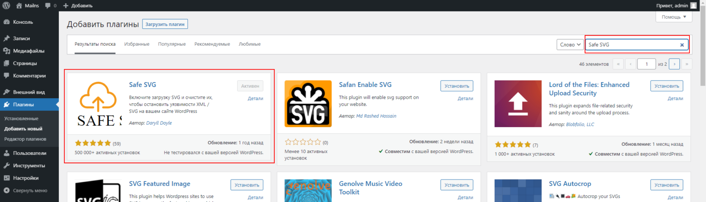

### Установка векторного логотипа WordPress
По умолчанию WordPress не поддерживает векторные изображения SVG из соображений безопасности. Для установки векторного логотипа необходимо включить поддержку загрузки и предпросмотра SVG, а также добавить фикцию отключения обрезки изображений.

Что такое SVG?
SVG – это сокращение от масштабируемой векторной графики, которая основана на XML и часто используется в интерактивных или анимированных изображениях.

SVG позволяет увеличивать изображения без потери их качества. В обычных обычных форматах изображений, таких как JPEG и PNG, при увеличении масштаба вы можете видеть пиксели изображения, но в формате SVG при увеличении масштаба пикселей не видно.

Векторные изображения обычно используются для логотипов, иконок и шрифтов.

Добавление поддержки SVG
По умолчанию WordPress не поддерживает формат SVG. Но это можно исправить вручную или использовать специальный плагин.

Использование плагина Safe SVG

Safe SVG – безопасный плагин, который вы можете использовать для загрузки файлов SVG в WordPress. Первое, что нужно сделать, это загрузить плагин. Вы можете скачать его с официального сайта WordPress или прямо из панели управления WordPress.



Просто наведите курсор на плагины и нажмите «Добавить». В поле поиска введите Safe SVG и нажмите клавишу ВВОД. Затем установите и активируйте плагин.

Изменение файла functions.php

Файл functions.php в себя важные функции, классы и фильтры. Также через него можно добавить поддержку формата SVG в WordPress.

Откройте functions.php перейдите вниз и вставьте фрагмент кода, приведенный ниже:
``` php
/**
 * Allow SVG files in Media Library.
 */
function extra_mime_types( $mimes ) {

	$mimes['svg'] = 'image/svg+xml';

	return $mimes;
}
add_filter( 'upload_mimes', 'extra_mime_types' );
```
Данный код лучше добавлять в файл functions.php используемой темы оформления, так как изменения внесенный в родительский файл functions.php теряются при обновлении WordPress.

Установка векторного логотипа
При выборе логотипа предлагается его обрезать, но при обрезании файла возникает ошибка: «При обрезке изображения произошла ошибка».

Для добавления кнопки «Не обрезать» откройте functions.php перейдите вниз и вставьте фрагмент кода, приведенный ниже:

``` php
/* Пропустить обрезку изображения */
 function logo_size_change(){
 remove_theme_support( 'custom-logo' );
 add_theme_support( 'custom-logo', array(
     'height'      => 100,
     'width'       => 400,
     'flex-height' => true,
     'flex-width'  => true,
 ) );
 }
 add_action( 'after_setup_theme', 'logo_size_change', 11 );
 ```
