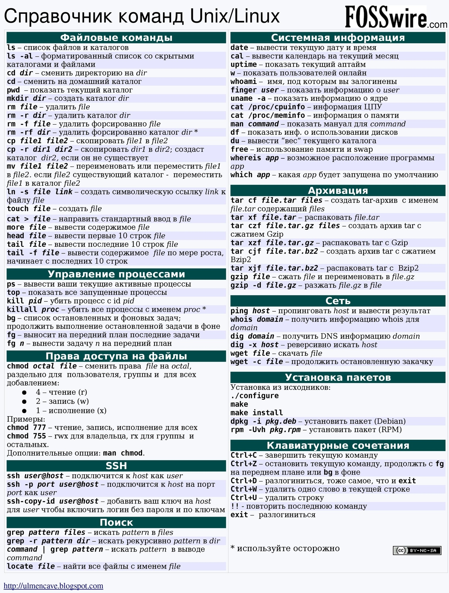

## Команды для терминала Linux/Ubuntu



## Управление репозиториями

- Добавить репозиторий:

```powershell
  sudo add-apt-repository ppa:librecad-dev/librecad-stable
```

- Удалить репозиторий:

```powershell
  sudo add-apt-repository -r ppa:librecad-dev/librecad-stable
```

## Работа с файлами

- Переименовать файл:

```powershell
  sudo mv read_example.php read_example.php
```

- Открыть файл в VSCode:

```powershell
  code . test.php
```

- Запустить файл из командной строки:

```powershell
  ./filetorun
```

## Поиск и установка пакетов

- Поиск по установленным пакетам apt:

```powershell
  sudo apt list | grep gimp
```

- Установка .deb пакета:

```powershell
  sudo dpkg -i sample_pakage.deb
```

## Погода в терминале

- Проверка погоды:

```powershell
  curl wttr.in/Belarus-Klinok
```

## Создание ярлыка для AppImage в Ubuntu

- Перейти в директорию:

```powershell
  cd /usr/share/applications
```

- Создать файл ярлыка:

```powershell
  touch inkscape.desktop
```

- Пример содержимого файла `inkscape.desktop`:

```
  [Desktop Entry]
  Version=1.2.2
  Type=Application
  Name=Inkscape
  GenericName=Inkscape
  Comment=Run Inkscape
  Exec=./Inkscape-b0a8486-x86_64.AppImage
  Icon=/home/mutilka/Inkscape_Logo.svg
```

- Ключ Exec:
  
 [The Exec key](https://specifications.freedesktop.org/desktop-entry-spec/latest/ar01s07.html)

  "Исполняемый (application/x-executable)" применять ключ %u

## Настройки PHP

### Поиск и редактирование php.ini

- Найти путь к файлу php.ini:

```powershell
  php -i | grep php.ini
```

- Пример результата:

```
  Configuration File (php.ini) Path => /etc/php/8.1/cli
  Loaded Configuration File => /etc/php/8.1/cli/php.ini
```

- Редактировать файл в vim:

```powershell
  sudo vim /etc/php/8.1/cli/php.ini
```

- Альтернативный путь для lampp:

```powershell
  sudo vim /opt/lampp/etc/php.ini
```

*После редактирования перезапустить сервер*

### Запуск PHP-файлов в браузере через VSCode

- Запустить сервер:

```powershell
  php -S localhost:8080
```

- Перейти к файлу в браузере:

```powershell
  http://localhost:8080/some_file.php
```

## Управление сервером LAMPP

- Запустить сервер:

```powershell
  sudo /opt/lampp/lampp start
```

- Остановить сервер:

```powershell
  sudo /opt/lampp/lampp stop
```

- Перезапустить сервер:

```powershell
  sudo /opt/lampp/lampp restart
```

### Добавление алиасов для LAMPP

- Открыть файл `.bashrc`:

```powershell
  sudo gedit ~/.bashrc
```

- Добавить алиасы:

```html
  #aliases
  alias lampp_start='sudo /opt/lampp/lampp start'
  alias lampp_stop='sudo /opt/lampp/lampp stop'
  alias lampp_restart='sudo /opt/lampp/lampp restart'
```

- Применить алиасы:

```
  lampp_start
  lampp_stop
  lampp_restart
```

- Проверить работу:

```powershell
  http://localhost/dashboard/
```

## Права доступа и владельцы

### Смена прав

- На текущую папку:

```powershell
  sudo find . -type d -exec chmod 777 {} \;
```

- На файлы в текущей папке:

```powershell
  sudo find . -type f -exec chmod 644 {} \;
```

### Смена владельца

- Для текущей папки и содержимого:

```powershell
  sudo chown username:username . -R
```

### Разрешение серверу создавать файлы

- Добавить пользователя daemon в группу username:

```powershell
  sudo usermod -a -G daemon username
```

## GIT: Форматирование коммитов

```
<type>(optional scope): <description>
^ __ ^^______________^^^^___________^
|     |               |||
|     |               ||+-> Заголовок с заглавной буквы
|     |               ||    Не более 50 символов
|     |               ||    Без точки в конце сообщения
|     |               ||    В повелительном наклонении (мы указываем коммиту,
|     |               ||    что он должен сделать), например:
|     |               ||    • Создать...
|     |               ||    • Изменить...
|     |               ||    • Удалить...
|     |               ||    • и т.п.
|     |               ||
|     |               ++--> Обязательные символы ":" и " "
|     |
|     +-------------------> Не обязательная область действия (где были изменения).
|                           Это может быть отдельный файл, директория
|                           или затронутая часть проекта.
|                           Указывается в круглых скобках, например:
|                           (api)!
|                           (lang)
|                           (ubuntu-cheatsheet.md)!
|                           (routing)
|                           и т.д.
|                           Может содержать символ "!" для привлечения внимания к
|                           критическим изменениям
|
+-------------------------> Рекомендуемые типы:
                            build    Изменения, которые влияют на систему сборки
                                     или внешние зависимости
                            chore    Рутинная работа
                            ci       Изменения в файлах конфигурации CI и скриптах
                            docs     Изменения только в документации
                            feat     Новая функция
                            fix      Исправление ошибки
                            perf     Изменение кода, улучшающее производительность
                            refactor Изменение кода, которое не исправляет ошибку
                                     и не добавляет функцию
                            style    Изменения, которые не влияют на смысл кода
                                     (пробелы, форматирование,
                                     отсутствующие точки с запятой и т.д.)
                            test     Добавление отсутствующих тестов
                                     или исправление существующих тестов

[optional body]
^_____________^
|
+-------------------------> Не обязательный текст развернутого описания коммита
                            Описывает дополнительную информацию об изменениях кода
                            Тело должно начинаться с одной пустой строки после заголовка
                            Может содержать несколько абзацев
                            Обычно отвечают на вопрос "Зачем были изменения?" и
                            "Почему сделаны именно такие изменения?" а не "Как?"

[optional footer(s)]: #
^__________________^^^^
|                   |||
|                   ||+---> Не обязательный символ "#"
|                   ||
|                   ++----> Обязательные символы ":" (двоеточие) и " " (пробел)
|
+-------------------------> Не обязательный текст нижнего колонтитула указывающий на
                            дополнительную информацию, а также является местом для указания
                            задач из бэклога, GitHub issues, тикетов, и других проблем,
                            которые этот коммит закрывает или с которыми он связан. 
                            Должен содержать ключевое слово или слова с заглавной буквы
                            разделенные символом "-", например:
                            BREAKING CHANGE:
                            Reviewed-by: pyatok.net
                            Refs: #123
                            Исключение для слов BREAKING CHANGE (критическое изменение),
                            которые должны быть ниписаны заглавными буквами с
                            пробелом и двоеточием в конце
```
#### Ссылки на стандарт:

- [Conventional Commits](https://www.conventionalcommits.org/en/v1.0.0/#summary)
- [Angular convention](https://github.com/angular/angular/blob/22b96b9/CONTRIBUTING.md#-commit-message-guidelines)
- [git trailer convention](https://git-scm.com/docs/git-interpret-trailers)

## Настройка оборудования

### Настройка принтера Epson Stylus PHOTO R295

- Установить драйвер:

```powershell
  sudo apt install printer-driver-gutenprint
```

- Найти PPD (PostScript Printer Description):

```powershell
  lpinfo -m | grep R290
```

- Пример результата:

```powershell
  gutenprint.5.3://escp2-r290/expert Epson Stylus Photo R290 - CUPS+Gutenprint v5.3.3
```

- Найти URI:

```powershell
  lpinfo -v
```

- Пример результата:

```powershell
  direct usb://EPSON/Stylus%20Photo%20R290?serial=573635503148A7E8A6
```

- Настроить принтер, заменив PPD и URI, выполнив команду::

```powershell
  lpadmin -p r290 -v usb://EPSON/Stylus%20Photo%20R290?serial=573635503148A7E8A6 -E -m gutenprint.5.3://escp2-r290/expert
```

- Напечатать тестовую страницу:

```powershell
  lp -d r290 /etc/nsswitch.conf
```
- Выдыхайте!

## Total Commander

### Настройка стрелок как PageUp/PageDown

- Открыть файл конфигурации: `Конфигурация \ Редактировать файлы конфигурации`
- Открывается 2 файла: `wincmd.ini`, `wcx_ftp.ini`
- В `wincmd.ini` после `[Configuration]` добавить:

```html
  SpecialCursorMovement=9
```

- Перезапустить Total Commander