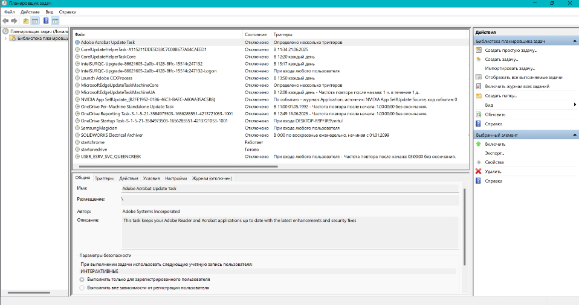

## Как запустить «Планировщик задач»?

- Нажимаем кнопку *«Пуск»* вводим **«Планировщик заданий»**, после его появления нажимаем на него.
- Вызываем окно *«Выполнить»* нажав **Win+R** и вводим в нем команду ```taskschd.msc```
- Нажимаем правой кнопкой мыши на кнопку *«Пуск»* и в выпадающем меню выбираем **«Управление компьютером»**. Щелкаем по узлу **«Служебные программы»** и там находим **«Планировщик заданий»**.



## Total Commander

### Настройка стрелок как PageUp/PageDown

- Открыть файл конфигурации: `Конфигурация \ Редактировать файлы конфигурации`
- Открывается 2 файла: `wincmd.ini`, `wcx_ftp.ini`
- В `wincmd.ini` после `[Configuration]` добавить:

```html
  SpecialCursorMovement=9
```

- Перезапустить Total Commander