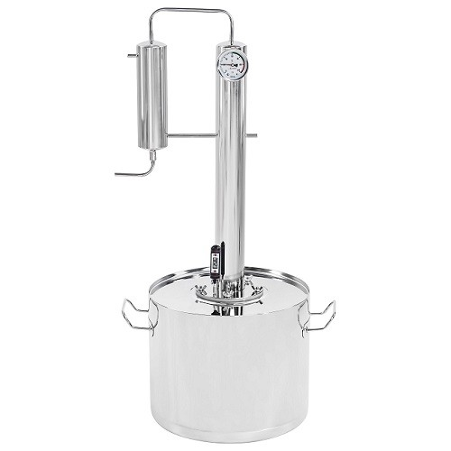

---
title: "Процесс дистилляции Меркель-PRO"
description: "Процесс дистилляции в бытовом дистилляторе Меркель-PRO (памятка)"
slug: process-distillyacii-merkel-pro
summary: ""
date: 2022-07-12T00:00:01+02:00
lastmod: 2022-07-12T00:00:02+02:00
draft: false
weight:
toc: true
categories: [blog]
tags: [рецепт, самогон, брага, самогонный аппарат, фишки, спирт, спирт сырец]
contributors: [mitulka]
pinned: false
homepage: false
seo:
  title: "" # custom title (optional)
  description: "" # custom description (recommended)
  canonical: "" # custom canonical URL (optional)
  robots: "" # custom robot tags (optional)
---

12 июля 2022

## Процесс дистилляции в бытовом дистилляторе Меркель-PRO (памятка)

### Шаг 1. Пропорции смешивания 
Смешать в дистилляторе 6 литров изделия первой перегонки (спирт сырец) + 6 литров холодной воды.
### Шаг 2. Предварительно нагреваем
Включить плиту, не подавая холодную воду нагревать до 60 °С по термометру в баке. Время **20 минут** (можно использовать таймер).
### Шаг 3. Подачём охлаждающую жидкость
Включить подачу охлаждающей воды. Продолжить нагревать до *80 °С по термометру в баке* (температура на термометре ректификационной колонны будет быстро подниматься до 60 °С) Приблизительное время **10 минут (контролировать процесс)!** Уменьшить нагрев сразу после начала процесса выгонки (потекла струйка).
### Шаг 4. «Снимаем головы»
Регулировкой температуры добиться расхода 1-2 капли в секунду. Время приблизительно **30 минут** (можно использовать таймер). Объем «голов» 150 мл. Температура для справки: бак — 85 °С, колонна — 70 °С
### Шаг 5. «Выгоняем тело» 
Установить максимальную температуру нагрева. Время выгонки **1 час 10 минут** (можно использовать таймер). Объем выгонки — 3 литра.
### Шаг 6. «Убираем хвосты»
Продолжаем процесс выгонки в отдельную тару до температуры в баке 98-99 °С или до практически полного останова процесса выгонки. Приблизительное время 10 — 15 минут.

> UPD: Фармацевтической мерой капли принято считать: для водных растворов — 0,05 мл, таким образом 20 капель есть 1 мл.